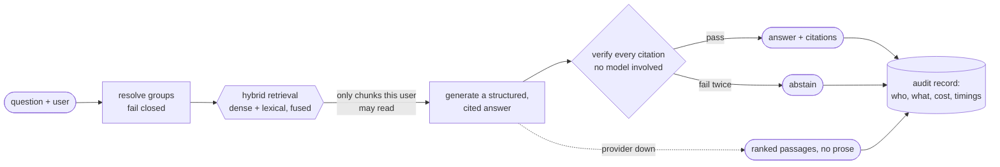

# AtlasOps

**Retrieval-augmented answers you can audit.** Every claim cites the passage it came from and is
checked before release. Access control runs inside retrieval, so a user's prompt never contains a
document they may not read. Quality, cost and latency are measured against real models, and the
numbers are published with their sample sizes.



## Try it

```bash
pnpm install
pnpm demo                    # free, offline, deterministic stand-in models
pnpm demo -- --models openai # real models; needs OPENAI_API_KEY, costs well under a cent
```

Five scenes, each ending in a property the output is checked against:

1. A cited answer, verified before release.
2. The same question from two users: the executive's reaches a hidden document, and nothing from
   it enters the reader's prompt.
3. A prompt injection that reaches nothing it is not allowed to.
4. Generation failing: the passages come back anyway.
5. The trace: stage timings, tokens, cost and time to first token.

## What it measured

Against `text-embedding-3-small` and `gpt-4.1-mini`, on a synthetic 35-chunk corpus. Each figure
links to its raw artefact, and the samples are small enough that none of them is a benchmark claim.

| Measure                                   | Result                          | Sample                 |
| ----------------------------------------- | ------------------------------- | ---------------------- |
| Retrieval nDCG@10, served configuration   | 0.866                           | 11 questions           |
| Citation precision / recall               | 1.00 / 1.00                     | 6 questions            |
| Permission leaks, existence disclosures   | 0 / 0                           | 6 probes, 2 injection  |
| Correct refusal of unanswerable questions | 0.75                            | 4 questions            |
| Time to the model's first token, p95      | 727 ms (budget 1,200)           | 260 requests           |
| End-to-end answer latency, p95            | 4,756 ms (budget 3,000; missed) | 260 requests           |
| Cost per answered question, p50 / p95     | $0.0008 / $0.0021               | 218 answered questions |

Sources: [evaluation](docs/evidence/run-fused-no-rerank.json),
[ablation](docs/evidence/ablation.md), [governance](docs/evidence/governance.md),
[load run](docs/measurements/load-run.json), and the
[accepted budget breaches](docs/measurements/accepted-breaches.json), each diagnosed and none raised.

## Decisions worth reading

- **The reranker was removed because the evidence said so** ([ADR 0011](docs/adr/0011-the-served-configuration-bypasses-the-stand-in-reranker.md)).
  With real embeddings, the only reranker available made ranking worse on both the development and
  the held-out split (nDCG@10 0.71 against 0.87).
- **Verification before release rules out streaming to users**
  ([ADR 0012](docs/adr/0012-generation-streams-so-time-to-first-token-is-measured.md)). Generation
  streams so time to first token is measured, but no token reaches a user before its citations are
  checked.
- **Generation failures degrade instead of erroring**
  ([ADR 0010](docs/adr/0010-generation-unavailable-degrades-to-ranked-passages.md)), and an
  evaluation leaves those queries out instead of scoring an outage as a decision.
- **The promotion verdict is generated from the artefacts**
  ([ADR 0009](docs/adr/0009-the-promotion-verdict-is-generated-and-the-proposal-stays-here.md)), and
  CI fails when a published document disagrees with them.

## Known limits and next steps

The corpus is small and synthetic, so a benchmark on real documents with more labelled questions is
the next measurement. Without a reranker, refusal is left to the generator (0.75 above); a real
rerank model would restore the score threshold. Storage is in-memory per process, so the four
components do not yet share a corpus. Everything else is in [`docs/limitations.md`](docs/limitations.md).

---

## The repository

Twelve packages (contracts, telemetry, governance, model-gateway, corpus, ingest, indexing,
retrieval, grounding, evalkit, composition, sandbox), five applications (answer API, ingestion
worker, evaluation runner, console, demo), and two exhibits (RAG-02 codebase, RAG-03 incident).
`pnpm verify` runs type checks, lint, formatting, 846 tests, the module-boundary check, and checks
that the corpus inventory, the datasets, the load-run budgets and the readiness verdict agree with
what is committed. CI runs the same command.

| Document                                                     | What it is                                             |
| ------------------------------------------------------------ | ------------------------------------------------------ |
| [`docs/prd/RAG-01-atlasops.md`](docs/prd/RAG-01-atlasops.md) | The specification. Section 11 is the module layout.    |
| [`docs/adr/`](docs/adr/)                                     | Twelve decisions, each recorded where it was made.     |
| [`docs/threat-model.md`](docs/threat-model.md)               | Four threats, each mitigation mapped to its test.      |
| [`docs/limitations.md`](docs/limitations.md)                 | What this does not do, and what it is not evidence of. |
| [`docs/promotion-readiness.md`](docs/promotion-readiness.md) | The generated verdict, artefact by artefact.           |
| [`docs/PHASES.md`](docs/PHASES.md)                           | The build plan, and the bar every phase met.           |
| [`docs/MODULES.md`](docs/MODULES.md)                         | The generated module table.                            |

The specification's canonical copy lives in the portfolio repository at
`docs/prd/projects/RAG-01-atlasops.md`. The copy here is the working reference; if the two ever
disagree, the portfolio copy wins.

### The one structural rule

Dependencies flow downward through the layers declared in `tools/boundaries/layers.json`, the graph
stays acyclic, and **exhibits are leaves**: nothing imports an exhibit, so any one of them can be
read, run, deleted or published on its own. `pnpm boundaries:check` enforces this in CI, because a
rule this load-bearing decays the first time someone is in a hurry.
